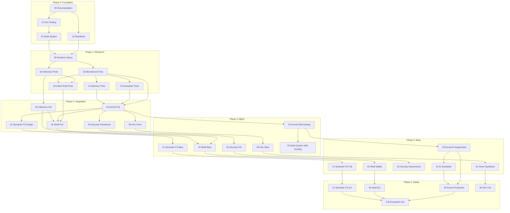

# Project Dependencies — Milestone Map

**Path:** `roadmaps/project-dependencies.md`  
**Version:** 0.1.0  
**Status:** Draft

---

## Dependency Graph by Phase



## Critical Path

The critical path to a functional system is:

```
00-Docs → 10-Standards → 30-Runtime → 20-Kernel → 40-Shell → Integration
                                                     60-Inference → 40-Shell
```

A delay in **30-Runtime** or **20-Kernel** will delay all downstream projects.

## Parallel Workstreams

These workstreams can proceed in parallel:

| Workstream | Projects | Lead Time |
|---|---|---|
| Kernel & Systems | 20, 21, 22, 30, 41 | 3–4 years |
| AI & Intelligence | 60, 61, 62, 70 | 2–3 years |
| Interface & Shell | 40, 80, 81 | 2–3 years |
| Hardware & Drivers | 90, 91 | 3–4 years |
| Security | 50 | 2–3 years |

## Dependency Verification

Before starting any project phase:

1. Confirm all declared dependencies are in **Active** or **Beta** status
2. Verify dependency API contracts are at least **Experimental** stability
3. Run the compatibility test suite from each dependency
4. Document any version pinning or workarounds

---

*Dependencies are not just technical — they are scheduling commitments.*
