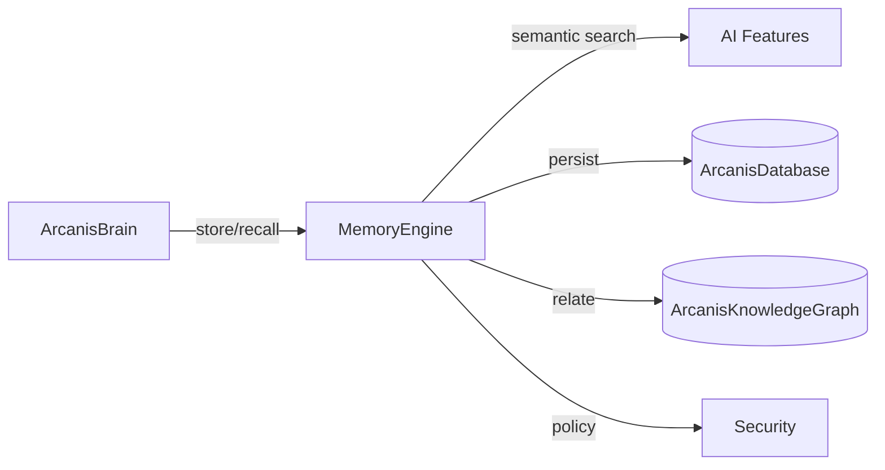

# ArcanisMemory

**Layer:** 3 (AI)  
**Status:** Alpha  
**Project ID:** 11-memory  
**Version:** 0.1.0

The memory layer that allows ArcanisBrain to remember information, preferences,
projects, and experiences.

## Overview

ArcanisMemory is a standalone memory service for the Arcanis ecosystem. It stores
memories across five memory types, retrieves them semantically, forgets what is
stale, organizes and ranks them, and exposes a clean API consumed by
ArcanisBrain.



## Memory Types

| Type | Purpose |
|---|---|
| `SHORT_TERM` | Volatile conversation memory for the active session |
| `LONG_TERM` | Durable personal memory about the user |
| `PROJECT` | Project-scoped facts, goals, and state |
| `KNOWLEDGE` | Domain facts and learned concepts |
| `EVENT` | Timestamped history of what happened |

## Capabilities

- **Store** — persist a memory with metadata, scope, and importance
- **Retrieve** — recall relevant memories by semantic or keyword query
- **Forget** — drop expired, low-importance, or user-deleted memories
- **Organize** — tag, scope, and relate memories into a graph
- **Rank** — score memories by importance, recency, and access frequency

## AI Features

- Semantic search over embeddings (delegated to ArcanisDatabase)
- Context building — assemble the most relevant memories for a prompt
- Memory summarization — compress many short-term memories into one
- Relationship detection — link related memories via shared entities

## Security

- User control: every memory carries an owner scope
- Memory permissions: per-scope read/write/forget policies
- Data encryption: at-rest encryption via ArcanisDatabase's CryptoEngine

## Dependencies

- `arcanisdb` (ArcanisDatabase, 0.1.0) — persistence + embeddings + crypto
- `arcanis_brain` (ArcanisBrain, 0.1.0) — integration consumer
- `arcanis_knowledge_graph` (ArcanisKnowledgeGraph) — relationship storage

## Quick Start

```python
from arcanis_memory import MemoryEngine, MemoryType

engine = MemoryEngine()
await engine.initialize()

mid = await engine.store(
    content="User prefers dark mode and minimal tooling.",
    memory_type=MemoryType.LONG_TERM,
    user_id="alice",
    tags=["preferences", "ui"],
)
results = await engine.recall(query="what does the user like?", user_id="alice")
print(results)
```

See [Architecture](docs/architecture.md) and the [API Reference](docs/api.md).

## Documentation

- [Architecture](docs/architecture.md)
- [API Reference](docs/api.md)
- [ADRs](docs/adr/)

## Contributing

See `00_Documentation/standards/` in the documentation repository.
