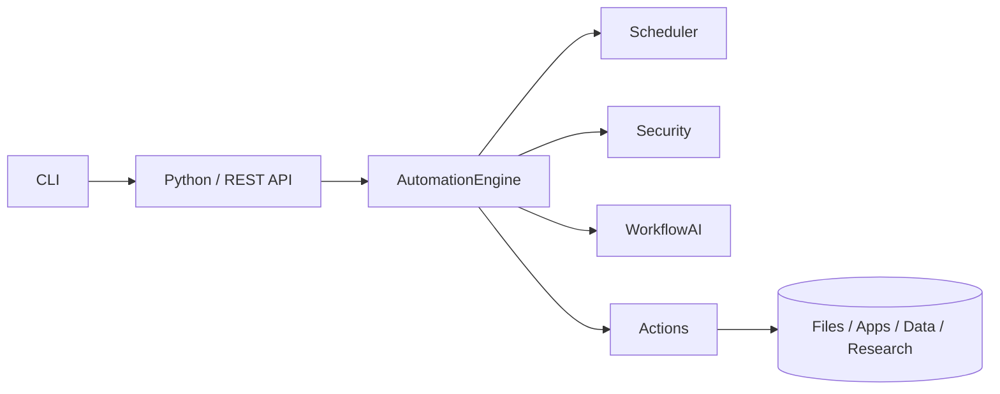

# ArcanisAutomation

**Layer:** 3 (AI / Automation)  
**Status:** Alpha  
**Project ID:** 13-automation  
**Version:** 0.1.0

ArcanisAutomation is the workflow automation engine for the Arcanis ecosystem.
It lets you create workflows, schedule tasks, trigger events, and chain actions
together — with built-in security, an AI co-pilot, and a clean API surface.



## Features

- **Workflow system** — create, schedule, trigger, and chain actions.
- **Automation examples** — file organization, application control, data
  processing, and research workflows ship as built-in actions.
- **AI capabilities** — generate workflows from descriptions, optimize them,
  and detect/diagnose failures.
- **Security** — permission control per action scope, safe execution sandbox,
  and append-only audit logging.

## Installation

```bash
pip install -e .            # core (dependency-free)
pip install -e ".[rest,ai,cron,dev]"   # with REST API, AI provider, cron, tests
```

## Quick Start

```python
from arcanis_automation import Automation

auto = Automation()
wid = auto.create(
    "hello",
    steps=[{"id": "s1", "action": {"action": "notify", "params": {"message": "hi"}}}],
)
print(auto.run(wid))
```

Generate a workflow from a description:

```python
wid = auto.generate("organize my downloads and notify me")
```

Run the REST API server:

```bash
arcanis-automation serve
# or
python -m arcanis_automation.api.rest_api run_server
```

## Workflow Format

A workflow is JSON with `name`, `description`, `triggers`, `steps`,
optional `schedule`, and `permissions`. See
[docs/workflow-format.md](docs/workflow-format.md).

```json
{
  "name": "Daily Organizer",
  "triggers": [{ "type": "schedule" }],
  "schedule": { "cron": "0 2 * * *" },
  "steps": [
    { "id": "organize", "action": { "action": "file.organize", "params": { "source": "~/Downloads" } } },
    { "id": "notify", "action": { "action": "notify", "params": { "message": "done" } }, "run_after": ["organize"] }
  ]
}
```

## Documentation

- [Architecture](docs/architecture.md)
- [Workflow Format](docs/workflow-format.md)
- [API Reference](docs/api.md)
- [Examples](examples/)

## Dependencies

- Python ≥ 3.10 (core has no third-party dependencies)
- Optional: `flask` (REST API), `openai` (cloud AI), `croniter` (cron scheduling)

## License

All rights reserved. ArcanisLabs — Sagar Makani.
